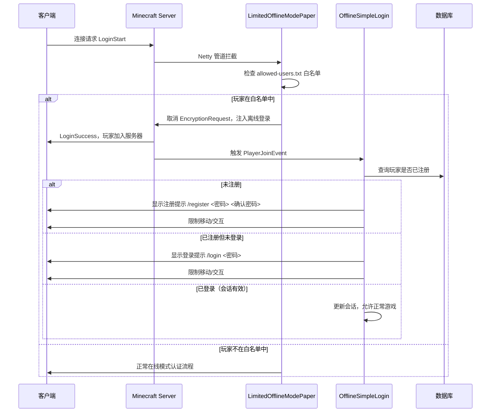
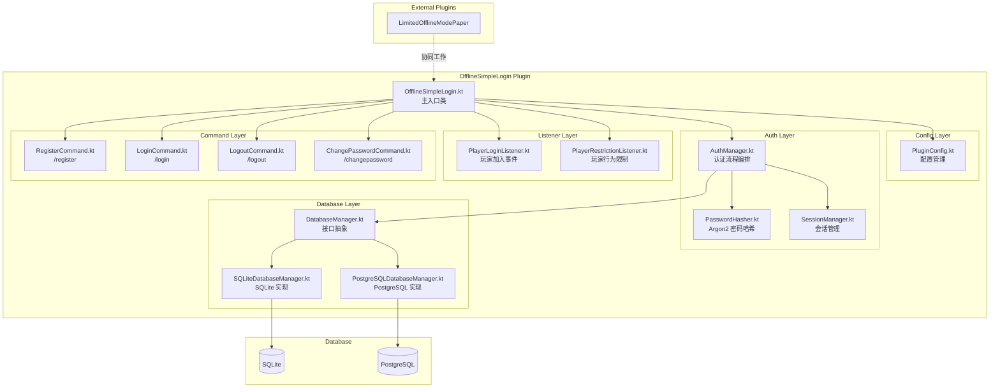

# OfflineSimpleLogin 插件实现计划

## 概述

开发一个支持 Folia 的 Minecraft Paper 插件，要求离线模式玩家进行注册和登录。密码使用 Argon2 加密后存储于 SQLite 或 PostgreSQL 数据库。与 [`LimitedOfflineModePaper`](D:\GITHUB\Limited-offline-mode-Paper) 插件协同工作：LimitedOfflineModePaper 负责 Netty 层拦截允许离线玩家加入，OfflineSimpleLogin 负责进服后的注册/登录认证。

---

## 架构设计

### 插件工作流程



### 模块架构



---

## 详细设计

### 1. 项目结构调整

| 文件 | 变更 |
|------|------|
| [`settings.gradle`](../settings.gradle) | `rootProject.name = 'OfflineSimpleLogin'` |
| [`build.gradle`](../build.gradle) | 添加 Kotlin 插件；添加数据库和 Argon2 依赖；更新 `group` 为 `io.github.moranyue.offlinesimplelogin`；移除不必要的依赖 |
| [`plugin.yml`](../src/main/resources/plugin.yml) | 更新主类、命令、权限；添加 `folia-supported: true` |
| [`config.yml`](../src/main/resources/config.yml) | 替换为数据库和认证相关配置 |

### 2. 依赖项

| 依赖 | 用途 | 类型 |
|------|------|------|
| `io.papermc.paper:paper-api:26.1.2.build.69-stable` | Paper API | compileOnly |
| `io.papermc:paperlib:1.0.8` | Paper 工具库 | implementation |
| `org.jetbrains.kotlin:kotlin-stdlib` | Kotlin 标准库 | implementation |
| `org.xerial:sqlite-jdbc` | SQLite 驱动 | implementation |
| `org.postgresql:postgresql` | PostgreSQL 驱动 | implementation |
| `com.zaxxer:HikariCP` | 连接池 | implementation |
| `de.mkammerer:argon2-jvm` | Argon2 密码哈希 | implementation |
| `org.jetbrains.kotlin:kotlin-test` | Kotlin 测试 | test |

移除不必要的模板依赖：
- `dev.jorel:commandapi-paper-shade` → 改用标准 Bukkit 命令
- `com.fasterxml.jackson.dataformat:jackson-dataformat-yaml` → 可选保留或移除
- `org.hibernate.validator:hibernate-validator` → 可选保留或移除

### 3. 配置文件 ([`config.yml`](../src/main/resources/config.yml))

```yaml
# 数据库配置
database:
  type: sqlite  # 可选: sqlite, postgresql
  
  # SQLite 配置
  sqlite:
    file: "data/offline-simple-login.db"
  
  # PostgreSQL 配置
  postgresql:
    host: localhost
    port: 5432
    database: offlinesimplelogin
    username: minecraft
    password: ""
    pool-size: 10

# Argon2 配置
argon2:
  salt-length: 16
  hash-length: 32
  parallelism: 1
  memory: 65536   # 64 MB
  iterations: 3

# 会话配置
session:
  timeout: 1800        # 会话超时时间（秒），默认30分钟
  ip-auto-login: true  # 是否基于 IP 自动登录

# 玩家限制
restrictions:
  prevent-movement: true
  prevent-interaction: true
  prevent-inventory: true
  prevent-chat: true
  prevent-damage: true
  prevent-command: false  # 允许使用注册/登录命令

# 消息配置（支持 MiniMessage 格式）
messages:
  register-prompt: "<red>请使用 /register <密码> <确认密码> 注册账号"
  login-prompt: "<red>请使用 /login <密码> 登录账号"
  register-success: "<green>注册成功！您已自动登录"
  login-success: "<green>登录成功！"
  login-failed: "<red>密码错误"
  already-registered: "<red>该账号已被注册"
  not-registered: "<red>该账号未注册，请先注册"
  already-logged-in: "<green>您已登录"
  logout-success: "<green>已登出"
  password-changed: "<green>密码修改成功"
  session-expired: "<red>会话已过期，请重新登录"
```

### 4. 数据库架构 ([`DatabaseManager.kt`](../src/main/java/io/github/moranyue/offlinesimplelogin/database/DatabaseManager.kt))

```sql
CREATE TABLE IF NOT EXISTS offline_players (
    username VARCHAR(16) PRIMARY KEY,
    password_hash TEXT NOT NULL,
    last_ip VARCHAR(45),
    last_login TIMESTAMP,
    registered_at TIMESTAMP NOT NULL DEFAULT CURRENT_TIMESTAMP,
    updated_at TIMESTAMP NOT NULL DEFAULT CURRENT_TIMESTAMP
);

CREATE TABLE IF NOT EXISTS offline_sessions (
    username VARCHAR(16) PRIMARY KEY,
    ip VARCHAR(45) NOT NULL,
    last_activity TIMESTAMP NOT NULL,
    expired BOOLEAN NOT NULL DEFAULT FALSE,
    FOREIGN KEY (username) REFERENCES offline_players(username)
);
```

**DatabaseManager 接口方法：**
- `connect()` - 初始化数据库连接
- `close()` - 关闭连接
- `createTables()` - 创建表结构
- `registerPlayer(username, passwordHash, ip)` - 注册新玩家
- `getPasswordHash(username)` - 获取密码哈希
- `isRegistered(username)` - 检查是否已注册
- `updateLastLogin(username, ip)` - 更新最后登录信息
- `saveSession(username, ip)` - 保存会话
- `getSession(username)` - 获取会话
- `removeSession(username)` - 移除会话
- `cleanExpiredSessions()` - 清理过期会话

### 5. Argon2 密码哈希 ([`PasswordHasher.kt`](../src/main/java/io/github/moranyue/offlinesimplelogin/auth/PasswordHasher.kt))

使用 `de.mkammerer:argon2-jvm` 库的 JNI 绑定。

```kotlin
class PasswordHasher(private val config: Argon2Config) {
    fun hash(password: String): String
    fun verify(password: String, hash: String): Boolean
}
```

### 6. 会话管理 ([`SessionManager.kt`](../src/main/java/io/github/moranyue/offlinesimplelogin/auth/SessionManager.kt))

```kotlin
class SessionManager(private val db: DatabaseManager, private val config: SessionConfig) {
    data class Session(
        val username: String,
        val ip: String,
        val lastActivity: Instant,
        val expired: Boolean = false
    )
    
    fun createSession(username: String, ip: String): Session
    fun getSession(username: String): Session?
    fun isValidSession(username: String, ip: String): Boolean
    fun removeSession(username: String)
    fun cleanExpiredSessions()
    fun isSessionExpired(session: Session): Boolean
}
```

### 7. 认证流程 ([`AuthManager.kt`](../src/main/java/io/github/moranyue/offlinesimplelogin/auth/AuthManager.kt))

```kotlin
class AuthManager(
    private val db: DatabaseManager,
    private val hasher: PasswordHasher,
    private val sessionManager: SessionManager
) {
    // 核心方法
    fun register(username: String, password: String, ip: String): AuthResult
    fun login(username: String, password: String, ip: String): AuthResult
    fun logout(username: String): AuthResult
    fun changePassword(username: String, oldPassword: String, newPassword: String): AuthResult
    fun isAuthenticated(username: String, ip: String): Boolean
    fun getAuthenticationStatus(username: String): AuthStatus
    
    enum class AuthResult { SUCCESS, ALREADY_REGISTERED, NOT_REGISTERED, WRONG_PASSWORD, SESSION_EXPIRED, ERROR }
    enum class AuthStatus { NOT_REGISTERED, LOGGED_IN, SESSION_EXPIRED }
}
```

### 8. 玩家限制 ([`PlayerRestrictionListener.kt`](../src/main/java/io/github/moranyue/offlinesimplelogin/listener/PlayerRestrictionListener.kt))

对未认证玩家执行以下限制：
- **移动限制**：取消 PlayerMoveEvent（允许一定范围的 tick）
- **交互限制**：取消 PlayerInteractEvent
- **背包操作**：取消 InventoryClickEvent, InventoryDragEvent, InventoryOpenEvent
- **聊天限制**：取消 AsyncPlayerChatEvent
- **伤害限制**：取消 EntityDamageEvent（玩家不受伤害，也不造成伤害）
- **命令白名单**：仅允许 /register, /login, /logout, /changepassword 命令

对已认证玩家的额外限制（可选）：
- 定期检查会话是否过期（使用异步定时任务）

### 9. Folia 兼容性

| Paper API | Folia API |
|-----------|-----------|
| `Bukkit.getScheduler().runTask(plugin, task)` | `Bukkit.getGlobalRegionScheduler().run(plugin, task)` |
| `Bukkit.getScheduler().runTaskLater(plugin, task, delay)` | `Bukkit.getGlobalRegionScheduler().runDelayed(plugin, task, delay)` |
| `Bukkit.getScheduler().runTaskTimer(plugin, task, delay, period)` | `Bukkit.getGlobalRegionScheduler().runAtFixedRate(plugin, task, delay, period)` |
| `Bukkit.getScheduler().runTaskAsynchronously(plugin, task)` | `Bukkit.getAsyncScheduler().runNow(plugin, task)` |
| `player.getLocation().getChunk()` | `player.getLocation()` 线程安全 |
| - | `plugin.yml` 中 `folia-supported: true` |

Folia 检测方法（与 LimitedOfflineModePaper 一致）：
```kotlin
fun isFolia(): Boolean = try {
    Class.forName("io.papermc.paper.threadedregions.TickRegionScheduler")
    true
} catch (e: ClassNotFoundException) {
    false
}
```

### 10. LimitedOfflineModePaper 集成

由于两个插件工作在不同层级，集成要点：

1. **无直接 API 依赖**：不需要修改 LimitedOfflineModePaper 的代码
2. **检测是否已安装**：通过 `Bukkit.getPluginManager().getPlugin("LimitedOfflineMode")` 检测
3. **协同工作流程**：
   - LimitedOfflineModePaper 通过 Netty 拦截，允许白名单离线玩家加入服务器
   - OfflineSimpleLogin 监听 PlayerJoinEvent，对离线玩家进行注册/登录认证
4. **可选增强**：如果 LimitedOfflineModePaper 已安装，可以共享白名单逻辑（仅认证已通过 LimitedOfflineModePaper 进入的玩家）
5. **命令冲突避免**：确保命令名称不冲突（LimitedOfflineModePaper 使用 `/lomgroup`，我们使用 `/register`, `/login` 等）

### 11. 命令详情

| 命令 | 权限 | 描述 | 用法 |
|------|------|------|------|
| `/register <password> <confirm>` | `offlinesimplelogin.register` | 注册账号 | 仅未注册玩家 |
| `/login <password>` | `offlinesimplelogin.login` | 登录账号 | 仅已注册未登录玩家 |
| `/logout` | `offlinesimplelogin.logout` | 登出账号 | 仅已登录玩家 |
| `/changepassword <old> <new>` | `offlinesimplelogin.changepassword` | 修改密码 | 仅已登录玩家 |

### 12. 权限节点

| 权限 | 默认 | 描述 |
|------|------|------|
| `offlinesimplelogin.register` | true | 允许注册 |
| `offlinesimplelogin.login` | true | 允许登录 |
| `offlinesimplelogin.logout` | true | 允许登出 |
| `offlinesimplelogin.changepassword` | true | 允许修改密码 |
| `offlinesimplelogin.admin` | op | 管理员权限 |

---

## 实现步骤

### 步骤 1：项目初始化配置
- 更新 [`settings.gradle`](../settings.gradle) - 项目名称
- 更新 [`build.gradle`](../build.gradle) - 添加 Kotlin 插件、新依赖；更新 group
- 更新 [`plugin.yml`](../src/main/resources/plugin.yml) - 主类、命令、权限、folia-supported
- 更新 [`config.yml`](../src/main/resources/config.yml) - 新配置结构
- 清理模板示例代码

### 步骤 2：配置管理 ([`PluginConfig.kt`](../src/main/java/io/github/moranyue/offlinesimplelogin/config/PluginConfig.kt))
- 数据类定义所有配置
- YAML 配置加载器

### 步骤 3：密码哈希服务 ([`PasswordHasher.kt`](../src/main/java/io/github/moranyue/offlinesimplelogin/auth/PasswordHasher.kt))
- Argon2 哈希与验证
- 配置参数：salt 长度、hash 长度、并行度、内存、迭代次数

### 步骤 4：数据库层
- [`DatabaseManager.kt`](../src/main/java/io/github/moranyue/offlinesimplelogin/database/DatabaseManager.kt) - 接口定义
- [`SQLiteDatabaseManager.kt`](../src/main/java/io/github/moranyue/offlinesimplelogin/database/SQLiteDatabaseManager.kt) - SQLite 实现
- [`PostgreSQLDatabaseManager.kt`](../src/main/java/io/github/moranyue/offlinesimplelogin/database/PostgreSQLDatabaseManager.kt) - PostgreSQL 实现（HikariCP 连接池）

### 步骤 5：会话管理 ([`SessionManager.kt`](../src/main/java/io/github/moranyue/offlinesimplelogin/auth/SessionManager.kt))
- 会话创建、验证、过期
- IP 自动登录支持

### 步骤 6：认证管理器 ([`AuthManager.kt`](../src/main/java/io/github/moranyue/offlinesimplelogin/auth/AuthManager.kt))
- 注册、登录、登出、修改密码
- 状态查询

### 步骤 7：玩家事件监听
- [`PlayerLoginListener.kt`](../src/main/java/io/github/moranyue/offlinesimplelogin/listener/PlayerLoginListener.kt) - 玩家加入时检查认证状态，发送提示
- [`PlayerRestrictionListener.kt`](../src/main/java/io/github/moranyue/offlinesimplelogin/listener/PlayerRestrictionListener.kt) - 限制未认证玩家的各类行为

### 步骤 8：命令实现
- [`RegisterCommand.kt`](../src/main/java/io/github/moranyue/offlinesimplelogin/command/RegisterCommand.kt)
- [`LoginCommand.kt`](../src/main/java/io/github/moranyue/offlinesimplelogin/command/LoginCommand.kt)
- [`LogoutCommand.kt`](../src/main/java/io/github/moranyue/offlinesimplelogin/command/LogoutCommand.kt)
- [`ChangePasswordCommand.kt`](../src/main/java/io/github/moranyue/offlinesimplelogin/command/ChangePasswordCommand.kt)

### 步骤 9：主插件类 ([`OfflineSimpleLogin.kt`](../src/main/java/io/github/moranyue/offlinesimplelogin/OfflineSimpleLogin.kt))
- `onEnable()` - 初始化配置、数据库、认证系统、注册监听器和命令
- `onDisable()` - 关闭数据库连接、清理会话
- Folia 兼容性检测

### 步骤 10：测试与构建验证
- 基本单元测试
- Gradle 构建验证

---

## 注意事项

1. **Argon2 原生库**：`de.mkammerer:argon2-jvm` 依赖 JNI 原生库，需要确保在 Windows/Linux 上正确加载。Shadow JAR 需要包含原生库文件。
2. **密码安全**：密码仅传输密码哈希，不在日志中记录明文密码。
3. **Folia 线程安全**：所有 Bukkit API 调用必须通过 Folia 兼容的调度器执行。
4. **数据库连接安全**：PostgreSQL 密码不硬编码，通过配置文件设置。
5. **LimitedOfflineModePaper 版本兼容性**：确保当前版本的 LimitedOfflineModePaper（1.1.0）的 Netty 拦截逻辑不受影响。
